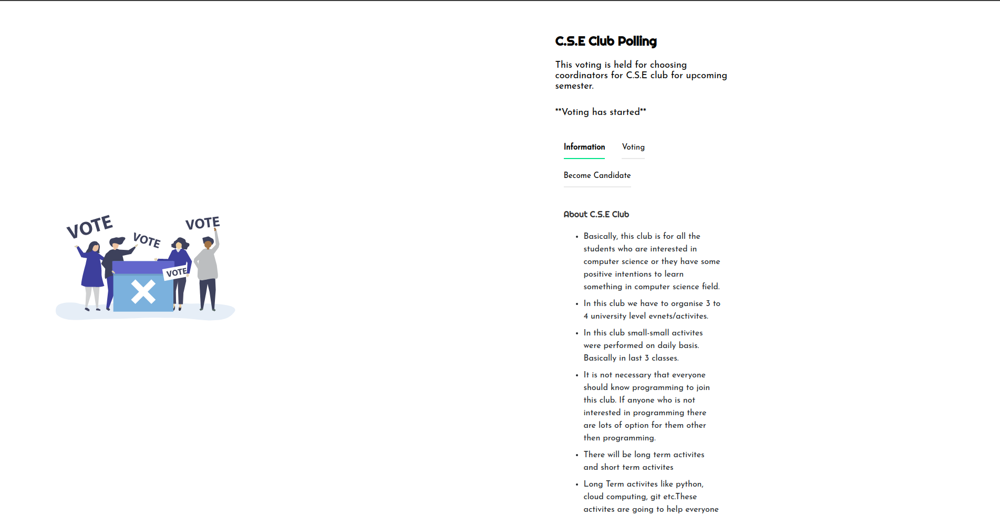

# Poll

## Introduction

It is a online voting application build for Cy-Fi Club of Career Point University. In this the student of Computer Science Department can come and vote for the person standing for a particular position.




## Setup

1. Install the required libraries

   ```shell
   pip install -r requirements.txt
   ```

2. Run the code

   ```shell
   python app.py
   ```


## Deployment

Use this article to deploy the application

https://shashikantdwivedi.com/how-to-host-flask-website-using-apache-on-ubuntu-server-in-aws/

